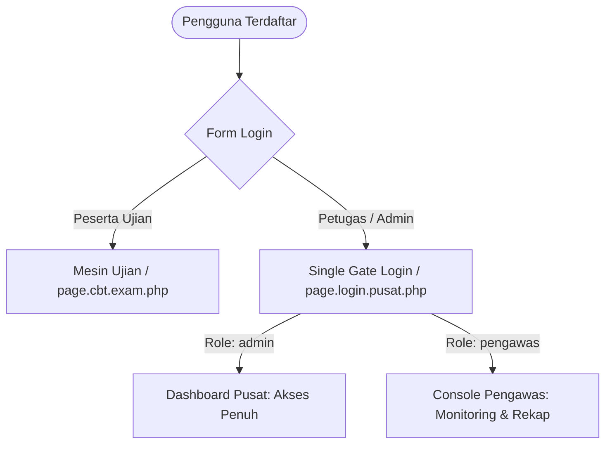
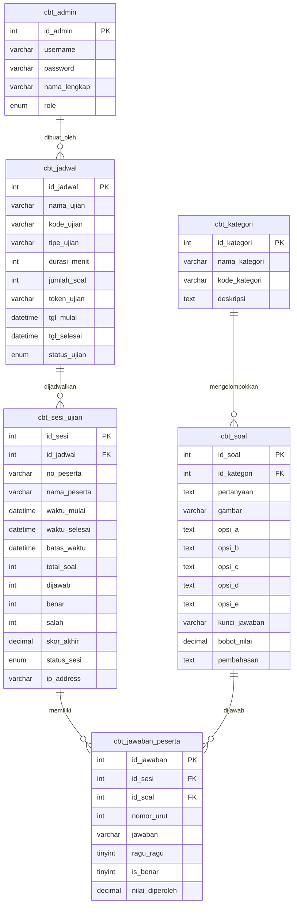

# Product Requirement Document (PRD) & Architecture Design Document
## SIMPEL CBT (Computer-Based Testing Engine)
**Versi Dokumen**: 3.0.0  
**Tanggal**: 04 September 2026  
**Status**: Release Candidate (Production Ready)  
**Arsitektur Standar**: SPMB v3 Modular MVC Pattern  
**Author / Maintainer**: Tim Pengembang SIMPEL CBT  

---

## 1. Executive Summary & Visi Produk

### 1.1 Latar Belakang
**SIMPEL CBT** adalah platform mesin ujian berbasis komputer (*Computer-Based Testing*) generasi modern yang dirancang untuk kebutuhan seleksi penerimaan mahasiswa baru (SPMB), ujian dinas, ujian sekolah/kampus, hingga sertifikasi kompetensi. Aplikasi ini dibangun dengan prinsip:
- **Zero AI-Slop & Modern Minimalist UI/UX**: Menggabungkan ketegasan fungsional ala *Sneat Design System* dengan kehalusan *clean design* (Slate-Indigo palette, tipografi Plus Jakarta Sans, dan mikrointeraksi yang responsif).
- **Arsitektur Modular Terpadu**: Mengadopsi standar direktori, router, dan konvensi penamaan yang identik dengan sistem `spmb_v3` (`controller/`, `model/`, `view/`).
- **Single Gate Authentication & Strict RBAC**: Satu gerbang login bersama yang secara otomatis membedakan hak akses Administrator Pusat dan Pengawas/Proctor Ruangan.
- **Interoperabilitas Standar Moodle**: Mendukung ekspor/impor butir soal berstandar internasional (Moodle XML, Aiken `.txt`, Excel/CSV, dan JSON Backup).

---

## 2. Struktur Versi & Semantic Versioning (SemVer)

SIMPEL CBT menerapkan penomoran versi berformat `MAJOR.MINOR.PATCH` (SemVer 2.0.0):

```
v3.0.0 (Current Stable Release)
 ├── MAJOR (3): Perombakan arsitektur total mengikuti standar modular spmb_v3 & integrasi Auth Bridge.
 ├── MINOR (0): Penyatuan pintu login, sistem import/export Moodle, & perombakan UI mobile responsive.
 └── PATCH (0): Rilis baseline stabil.
```

### Roadmap & Versi Rilis
| Versi | Status | Tanggal Rilis | Fokus Utama |
| :--- | :---: | :---: | :--- |
| **v1.0.0** | Legacy | Jan 2025 | Mesin ujian dasar berbasis PHP Native + MySQL procedural. |
| **v2.0.0** | Legacy | Jun 2025 | Penambahan fitur token jadwal dan live monitoring dasar. |
| **v3.0.0** | **Current** | Sep 2026 | Refactoring arsitektur MVC modular `spmb_v3`, Single Login Gate, Multi-format Moodle Import/Export, Mobile Drawer, Session Security, Strict RBAC. |
| **v3.1.0** | Planned | Q4 2026 | Dukungan tipe soal kompleks: Menjodohkan (*Matching*), Benar-Salah (*True/False*), dan Esai Tergradasi. |
| **v3.2.0** | Planned | Q1 2027 | Fitur *AI Question Generator* dari dokumen PDF/Word & Deteksi Kecurangan (*Face Recognition / Tab Switching Lockdown*). |
| **v4.0.0** | Vision | Q3 2027 | Dukungan High-Availability Cluster, WebSocket Realtime Monitoring (Redis/Socket.io), dan REST API Headless untuk Mobile App (Flutter/React Native). |

---

## 3. Arsitektur Sistem & Direktori

SIMPEL CBT mengadopsi pola **Front Controller & Modular Action-Based Dispatcher**:

```text
simpel_cbt/
├── admin/                      # Entrypoint redirector direktori admin
│   └── index.php               # Mengarahkan sesi aktif ke index.php?m=pusat
├── assets/                     # Asset statis antarmuka
│   ├── css/                    # Custom layout & demo styles
│   ├── img/                    # Ilustrasi, avatar, background, favicon
│   ├── js/                     # Helper script & komponen UI
│   └── vendor/                 # Pustaka pihak ketiga (Bootstrap 5, Boxicons, ApexCharts)
├── controller/                 # Lapisan Controller & Router
│   └── route/
│       ├── route.main.php      # Central Dispatcher router utama (?m=...)
│       ├── route.admin.php     # Controller route khusus Administrator
│       └── route.pengawas.php  # Controller route khusus Pengawas Ruang
├── model/                      # Lapisan Model, Helper, AJAX, dan Config
│   ├── ajax/
│   │   └── cbt/                # Async Endpoint pengolah data (JSON API)
│   │       ├── exam_api.php        # Otentikasi peserta, token, & simpan jawaban
│   │       ├── jadwal_crud.php     # Pengelolaan paket jadwal & token aktif
│   │       ├── kategori_crud.php   # Pengelolaan kategori butir soal
│   │       ├── monitoring_api.php  # Polling live status peserta & reset sesi
│   │       ├── soal_crud.php       # CRUD butir soal, pilihan, & kunci
│   │       └── user_crud.php       # Manajemen akun admin & proctor ruang
│   ├── config/                 # Konfigurasi basis data & migrasi
│   │   ├── config.conn.php         # Koneksi DB utama (mysqli) & session security
│   │   ├── config.auth_bridge.php  # Konfigurasi integrasi DB klien eksternal
│   │   └── cbt_migration.php       # Skrip migrasi & inisialisasi tabel
│   ├── export/                 # Engine Ekspor & Impor Berkas
│   │   ├── export_rekap.php        # Ekspor rekap nilai per paket ujian
│   │   └── soal_import_export.php  # Engine Moodle XML, Aiken, CSV, & JSON
│   └── helper/                 # Pustaka fungsi pembantu (Reusable Helpers)
│       ├── auth.helper.php         # Otorisasi sesi, RBAC, & proteksi login
│       ├── auth_bridge.helper.php  # Validasi nomor pendaftaran lintas database
│       └── cbt.helper.php          # Utilitas perhitungan skor, token, sanitizer
├── pengawas/                   # Entrypoint redirector pengawas ruangan
│   ├── index.php               # Redirect ke index.php?m=pusat#monitoring
│   ├── login.php               # Redirect ke index.php?m=login-pusat
│   └── logout.php              # Redirect ke index.php?m=logout
├── pusat/                      # Entrypoint redirector administrator
│   ├── index.php               # Redirect ke index.php?m=pusat
│   ├── login.php               # Redirect ke index.php?m=login-pusat
│   └── logout.php              # Redirect ke index.php?m=logout
├── uploads/                    # Direktori penyimpanan media (gambar butir soal)
│   └── cbt/
├── view/                       # Lapisan Antarmuka Pengguna (View)
│   ├── private/
│   │   └── page/               # Halaman portal & mesin ujian peserta
│   │       ├── page.login.peserta.php   # Gerbang masuk peserta ujian
│   │       ├── page.login.pusat.php     # Gerbang login tunggal petugas (Admin & Proctor)
│   │       ├── page.cbt.exam.php        # Mesin ujian online full-screen interaktif
│   │       └── page.cbt.print.php       # Lembar cetak hasil / kartu nilai ujian
│   └── public/
│       └── content/
│           └── page/           # Dashboard kerja terpadu
│               ├── page.pusat.php       # Dashboard terpadu Admin & Pengawas
│               └── page.pengawas.php    # Standalone view pengawas ruangan
├── .gitignore
├── database.sql                # Skema DDL & DML basis data bawaan
├── exam.php                    # Compatibility bridge ke mesin ujian
├── index.php                   # Front Controller utama aplikasi
├── print.php                   # Compatibility bridge ke halaman cetak
└── PRD.md                      # Dokumen spesifikasi produk & arsitektur
```

---

## 4. Peran Pengguna & Matriks Hak Akses (RBAC)

Sistem membagi aktor ke dalam 3 peran (*roles*):



### Matriks Otorisasi Fitur
| Modul & Fitur | Peserta Ujian | Pengawas / Proctor | Administrator Pusat |
| :--- | :---: | :---: | :---: |
| Masuk Ujian & Validasi Token | ✅ | ❌ | ❌ |
| Mengerjakan Ujian & Navigasi Ragu-Ragu | ✅ | ❌ | ❌ |
| Cetak Hasil Ujian Mandiri | ✅ | ❌ | ❌ |
| Live Monitoring Realtime Peserta | ❌ | ✅ | ✅ |
| Paksa Selesai (*Force Finish*) Sesi Peserta | ❌ | ✅ | ✅ |
| Reset Status Ujian / Kendala PC Hang | ❌ | ✅ | ✅ |
| Cetak Lembar Hasil Nilai Ruangan | ❌ | ✅ | ✅ |
| Rekap & Analisis Nilai Ujian | ❌ | ✅ | ✅ |
| Ekspor Nilai (*Spreadsheet*) | ❌ | ✅ | ✅ |
| Kelola Bank Soal (Tambah, Edit, Hapus) | ❌ | ❌ | ✅ |
| Impor Soal (Moodle XML, Aiken, CSV) | ❌ | ❌ | ✅ |
| Ekspor Soal (Moodle XML, Aiken, CSV, JSON) | ❌ | ❌ | ✅ |
| Kelola Kategori & Bobot Soal | ❌ | ❌ | ✅ |
| Kelola Jadwal Ujian & Generate Token | ❌ | ❌ | ✅ |
| Kelola Akun Petugas & Kredensial Proctor | ❌ | ❌ | ✅ |
| Konfigurasi Auth Bridge (Database Eksternal) | ❌ | ❌ | ✅ |

---

## 5. Rincian Fitur Utama

### 5.1 Portal Peserta & Mesin Ujian (`page.cbt.exam.php`)
- **Autentikasi Otomatis**: Mendukung verifikasi instan identitas peserta via nomor pendaftaran SPMB/NIK.
- **Validasi Token Ujian**: Token dinamis 6 digit yang diterbitkan oleh pengawas ruang.
- **Timer & Auto-Submit**: Penghitung mundur waktu dengan auto-submit saat durasi habis.
- **Navigasi Butir Soal Cerdas**:
  - Palet nomor soal dengan indikator status: *Belum Dijawab* (Abu-abu), *Sudah Dijawab* (Hijau), dan *Ragu-Ragu* (Kuning).
  - Simpan jawaban instan berbasis *local state* & async AJAX background sync.
- **Cetak Bukti Nilai (`page.cbt.print.php`)**: Menampilkan skor nilai total, rincian per kategori, dan QR code validasi.

### 5.2 Single Gate Login Petugas (`page.login.pusat.php`)
- Pintu masuk bersama untuk admin dan pengawas ruangan.
- Dilengkapi sistem proteksi *brute force*, sanitasi input, dan *password hashing* bcrypt standar `PASSWORD_DEFAULT`.
- Pengalihan cerdas (*smart redirect*) ke modul yang relevan sesuai peran.

### 5.3 Dashboard & Console Terpadu (`page.pusat.php`)
- **Desain Hybrid Minimalis**: Sisi kiri sidebar elegan, topbar dengan indikator profil & status koneksi DB, area kerja kartu modern.
- **Mobile Responsive Drawer**: Pada resolusi layar ponsel/tablet (< 992px), sidebar otomatis berubah menjadi *sliding drawer offcanvas* dengan tombol hamburger dan *backdrop blur*.
- **State Persistence**: Menggunakan URL hash (`#soal`, `#monitoring`, `#rekap`, `#jadwal`, dll.) dan `localStorage` sehingga posisi halaman tidak berpindah saat ditekan tombol **Refresh (F5)**.

### 5.4 Mesin Impor & Ekspor Soal Standar Moodle (`soal_import_export.php`)
1. **Moodle XML Format (`.xml`)**:
   - Struktur resmi kuis Moodle dengan tag `<question type="multichoice">`.
   - Pembungkus CDATA pada teks pertanyaan dan pilihan jawaban.
   - Perhitungan bobot fraksi (`fraction="100"` untuk kunci benar, `fraction="0"` untuk pilihan salah).
2. **Format Aiken (`.txt`)**:
   - Format teks minimalis terpopuler:
     ```text
     Pertanyaan nomor satu?
     A. Pilihan pertama
     B. Pilihan kedua
     C. Pilihan ketiga
     D. Pilihan keempat
     ANSWER: A
     ```
   - Dilengkapi fitur **Fast Paste Textarea** untuk menyalin naskah soal langsung dari dokumen Word tanpa perlu menyimpan file terpisah.
3. **Excel / CSV Format (`.csv`)**:
   - Format spreadsheet berstruktur dengan header: `Pertanyaan, Pilihan A, Pilihan B, Pilihan C, Pilihan D, Pilihan E, Kunci, Bobot, Pembahasan`.
   - Dilengkapi *UTF-8 Byte Order Mark (BOM)* agar karakter khusus dan simbol matematika terbaca sempurna di Microsoft Excel.
4. **JSON Backup (`.json`)**:
   - Struktur pencadangan lengkap (*raw dump*) untuk migrasi antar-server CBT.

### 5.5 Live Monitoring & Console Pengawas
- Polling asinkron otomatis setiap 10 detik.
- Menampilkan metrik realtime: *Sedang Mengerjakan*, *Selesai Ujian*, *Total Masuk*, dan *Perlu Bantuan/Reset*.
- Aksi kendali pengawas:
  - **Paksa Selesai**: Menghentikan ujian peserta secara paksa jika melanggar tata tertib.
  - **Reset Sesi**: Membuka kembali sesi peserta yang terkunci akibat insiden listrik mati / komputer hang.
  - **Hapus Sesi**: Membersihkan log sesi yang tidak valid.

---

## 6. Spesifikasi Basis Data (Schema DDL)

Sistem menggunakan basis data relasional MySQL/MariaDB dengan mesin InnoDB:



---

## 7. Rute & Endpoint API

### 7.1 Rute Navigasi Web (Front Controller)
| URL / Rute | Handler | Keterangan |
| :--- | :--- | :--- |
| `http://localhost/simpel_cbt/` | `page.login.peserta.php` | Halaman utama portal ujian peserta |
| `http://localhost/simpel_cbt/?m=login-pusat` | `page.login.pusat.php` | Form login bersama petugas (Admin & Proctor) |
| `http://localhost/simpel_cbt/?m=pusat` | `route.admin.php` $\rightarrow$ `page.pusat.php` | Dashboard utama Administrator |
| `http://localhost/simpel_cbt/?m=pengawas` | `route.pengawas.php` $\rightarrow$ `page.pusat.php` | Console kerja Pengawas Ruangan |
| `http://localhost/simpel_cbt/?m=exam&id_sesi=X` | `page.cbt.exam.php` | Mesin ujian interaktif peserta |
| `http://localhost/simpel_cbt/?m=print&id_sesi=X` | `page.cbt.print.php` | Halaman cetak bukti hasil ujian |
| `http://localhost/simpel_cbt/?m=logout` | `auth.helper.php` | Pengakhiran sesi petugas |

### 7.2 Endpoint AJAX Backend (`model/ajax/cbt/`)
| File Endpoint | Parameter Utama | Respon | Fungsi |
| :--- | :--- | :--- | :--- |
| `soal_crud.php` | `action=list/detail/save/delete` | `JSON` | Pengelolaan data butir soal |
| `kategori_crud.php` | `action=list/detail/save/delete` | `JSON` | Pengelolaan kategori bidang ilmu |
| `jadwal_crud.php` | `action=list/save/delete/generate_token` | `JSON` | Pembuatan paket ujian & rilis token |
| `monitoring_api.php` | `action=list_peserta/force_finish/reset_sesi` | `JSON` | Pemantauan & kontrol sesi ujian |
| `user_crud.php` | `action=list/save/delete/change_password` | `JSON` | Manajemen pengguna admin & pengawas |
| `exam_api.php` | `action=lookup/start/save_answer/finish` | `JSON` | Engine operasi peserta ujian |
| `soal_import_export.php`| `action=export/import/template` | `XML/TXT/CSV/JSON` | Engine berkas Moodle & spreadsheet |

---

## 8. Standar Keamanan & Reliabilitas

1. **Prepared Statements & Sanitasi Ketat**:
   - Seluruh kueri basis data dieksekusi dengan *prepared statements* mysqli atau sanitasi escape string guna mengeliminasi celah **SQL Injection**.
2. **Proteksi Sesi & Cookie**:
   - Pengaturan `session.use_strict_mode = 1`, `session.use_only_cookies = 1`, dan cookie bertanda `HttpOnly` serta `SameSite: Lax` untuk mencegah **Session Hijacking & XSS**.
3. **Cross-Site Scripting (XSS) Prevention**:
   - Seluruh output dinamis yang berasal dari input pengguna disanitasi menggunakan `htmlspecialchars(..., ENT_QUOTES, 'UTF-8')`.
4. **Resistansi Gangguan Jaringan Peserta**:
   - Setiap kali peserta memilih opsi jawaban, status langsung dicatat secara lokal dan dikirimkan secara asinkron ke server. Jika komputer peserta mati mendadak, jawaban yang telah tersimpan tidak akan hilang.

---

## 9. Petunjuk Instalasi & Deployment

### 9.1 Persyaratan Server
- **Web Server**: Apache 2.4+ / Nginx
- **PHP Version**: PHP 8.0, 8.1, 8.2, atau 8.3
- **PHP Extensions**: `mysqli`, `session`, `json`, `mbstring`, `dom`, `libxml`, `gd`
- **Database**: MySQL 5.7+ / MariaDB 10.4+

### 9.2 Langkah Pemasangan
1. Salin direktori proyek ke `htdocs` (misal: `C:\xampp\htdocs\simpel_cbt`).
2. Impor berkas basis data `database.sql` ke MySQL via phpMyAdmin atau CLI:
   ```bash
   mysql -u root -p simpel_cbt < database.sql
   ```
3. Sesuaikan konfigurasi kredensial pada file [`model/config/config.conn.php`](file:///C:/xampp/htdocs/simpel_cbt/model/config/config.conn.php).
4. Akses aplikasi melalui browser:
   - Portal Peserta: `http://localhost/simpel_cbt/`
   - Portal Petugas: `http://localhost/simpel_cbt/?m=login-pusat`

---

## 10. Kesimpulan & Penutup
Dokumen PRD dan Arsitektur ini menetapkan cetak biru teknis lengkap untuk **SIMPEL CBT v3.0.0**. Dengan arsitektur yang modular, antarmuka yang bersih dan responsif, interoperabilitas Moodle, serta proteksi hak akses yang teruji, aplikasi ini siap digunakan secara andal dalam skala pengujian institusional maupun nasional.
